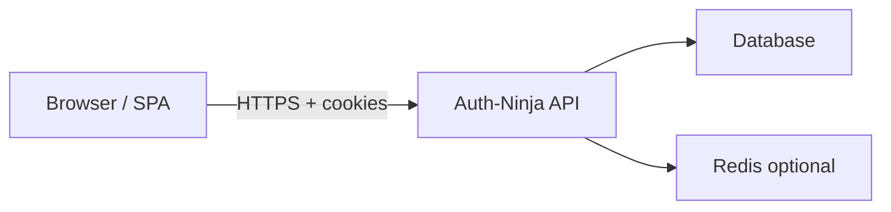

# Auth-Ninja threat model

STRIDE analysis for authentication flows implemented by Auth-Ninja adapters (Next.js, .NET) and consumed by headless React hooks. This document drives security requirements in `AGENTS.md`, `.cursor/rules/auth-ninja-security.mdc`, and subsequent implementation tasks.

**Status:** Living document — update when adding endpoints or changing session/MFA behavior.

---

## Scope

### In scope

| Flow | Description |
| --- | --- |
| Register | Create account with email + password; optional invite/token gate (host app) |
| Login | Password verify; session cookie issued; session ID rotated |
| Logout | Server-side session invalidation; cookie cleared |
| Session | `GET /session` — read current user; idle + absolute timeouts |
| Password reset | Request reset (generic response); consume one-time token; set new password |
| TOTP 2FA | Enroll secret, verify code, backup/recovery codes |
| Passkeys | WebAuthn registration and authentication |
| CSRF | Double-submit or synchronizer token on state-changing routes |
| Rate limiting | Per-IP limits on auth endpoints |
| Lockout | Failed-attempt counter per account/IP |
| IP audit | Login, logout, lockout, and suspicious IP events |

### Out of scope

- Host application authorization (RBAC, resource-level permissions) beyond “authenticated vs anonymous”
- OAuth/OIDC social login (may be added later; not in v0.1)
- Email delivery infrastructure (SMTP provider compromise, phishing templates)
- Client device compromise (keyloggers, malware) — users must protect endpoints
- Physical access to operator workstations

### Assumptions

- Production traffic is **HTTPS**; `Secure` cookies are enforced.
- `AUTH_NINJA_SECRET` is ≥ 32 cryptographically random bytes, stored in a secret manager.
- Session tokens live only in **HttpOnly, Secure, SameSite=Strict** cookies — never `localStorage` / `sessionStorage`.
- Database and Redis (if used for distributed rate limit/lockout) are network-isolated and access-controlled.
- Host apps do not embed session tokens in URLs or third-party analytics.

---

## Assets

| Asset | Sensitivity | Storage |
| --- | --- | --- |
| User passwords | Critical | Argon2id hash only — never plaintext |
| Session identifiers | Critical | Server store + HttpOnly cookie |
| `AUTH_NINJA_SECRET` | Critical | Environment / secret manager |
| TOTP seeds | Critical | Encrypted at rest; never logged |
| WebAuthn credential public keys | High | Database |
| WebAuthn challenges | High | Server-side, short TTL |
| Backup / recovery codes | Critical | Hashed; single-use |
| Password reset tokens | Critical | Hashed; short TTL; single-use |
| Audit events | Medium | Append-only log / table |
| User email (identifier) | Medium | Database |

---

## Trust boundaries

| Boundary | Threat focus |
| --- | --- |
| Browser ↔ API | CSRF, XSS token theft, user enumeration, credential stuffing |
| API ↔ DB | SQL injection, credential leakage in queries |
| API ↔ Redis | Cache poisoning, rate-limit bypass if misconfigured |
| Operator ↔ secrets | Weak `AUTH_NINJA_SECRET`, committed `.env` files |

---

## Auth flows (summary)

1. **Register** — validate input → hash password → create user → optional auto-login with new session.
2. **Login** — generic failure on bad credentials → lockout check → password verify → MFA step if enabled → rotate session ID → set cookie.
3. **Session** — validate cookie → load session → enforce idle/absolute expiry → return user snapshot.
4. **Logout** — invalidate server session → clear cookie.
5. **Password reset** — always generic “if account exists…” → email token (host) → verify token → re-hash password → invalidate sessions.
6. **TOTP enroll/verify** — generate secret server-side → user confirms code → store encrypted seed; backup codes hashed.
7. **Passkey register/login** — server challenge → client WebAuthn → verify origin/RP ID → bind or authenticate credential.

---

## STRIDE by flow

Each row: **Threat** → **Impact** → **Mitigation** (implemented or required by task catalog).

### Register

| STRIDE | Threat | Impact | Mitigation |
| --- | --- | --- | --- |
| **S** | Attacker registers as victim email to squat account | Account takeover when victim later registers | Generic responses; email verification (host); unique email constraint |
| **T** | Tamper registration payload (role flags, admin bits) | Privilege escalation | Server-side schema only; ignore client-supplied roles |
| **R** | User denies creating account | Disputes | Audit `register` event with IP (no PII in message body) |
| **I** | Response reveals “email already registered” | User enumeration | **Generic** success/error message and similar timing |
| **D** | Mass registration flood | DB/storage exhaustion | Rate limit per IP; CAPTCHA (host app optional) |
| **E** | Register endpoint accepts elevated claims | Admin account creation | No privilege fields in public register API |

### Login (password)

| STRIDE | Threat | Impact | Mitigation |
| --- | --- | --- | --- |
| **S** | Credential stuffing / password spraying | Account compromise | Lockout; rate limit; Argon2id; optional MFA |
| **S** | Session fixation — attacker sets victim’s session ID pre-login | Hijack post-login session | **Regenerate session ID** on successful login |
| **T** | Modify session cookie value | Impersonation | Opaque server-side session; HMAC/signed ID; constant-time lookup |
| **R** | User denies login | Fraud repudiation | Audit successful/failed login (no passwords logged) |
| **I** | “Unknown email” vs “wrong password” messages | User enumeration | **Generic** `INVALID_CREDENTIALS`; timing normalization where feasible |
| **D** | High-volume login attempts | Service degradation | Per-IP rate limit; exponential backoff; lockout |
| **E** | Skip MFA after password success | Weaker auth than policy | `MFA_REQUIRED` gate; no session until MFA completes |

### Session (`GET /session`, cookie refresh)

| STRIDE | Threat | Impact | Mitigation |
| --- | --- | --- | --- |
| **S** | Stolen session cookie (XSS, network) | Account takeover | HttpOnly + Secure + SameSite=Strict; short idle timeout (15 min default) |
| **T** | Extend session by tampering expiry client-side | Prolonged unauthorized access | Expiry enforced server-side only |
| **R** | Deny active session | Support disputes | Session metadata + audit trail |
| **I** | Session endpoint leaks PII or internal IDs | Information disclosure | Minimal user DTO; no session ID in JSON body |
| **D** | Session polling storm | CPU/DB load | Rate limit; caching with short TTL where safe |
| **E** | Reuse expired session after idle/absolute limit | Unauthorized access | Fail closed → `SESSION_EXPIRED`; destroy cookie |

### Logout

| STRIDE | Threat | Impact | Mitigation |
| --- | --- | --- | --- |
| **S** | CSRF logout — attacker logs victim out | Availability annoyance; MFA confusion | CSRF token on POST logout |
| **T** | Logout without server invalidation | Old cookie still valid | Delete server session row; clear cookie |
| **R** | Deny logout action | Audit gaps | Audit logout event |
| **I** | — | — | No sensitive data in logout response |
| **D** | Logout spam | Minor DoS | Rate limit |
| **E** | — | — | Logout cannot elevate privileges |

### Password reset

| STRIDE | Threat | Impact | Mitigation |
| --- | --- | --- | --- |
| **S** | Attacker triggers reset for victim | Harassment; token interception if email weak | Generic response; short-lived single-use token; invalidate on use |
| **T** | Guess/brute reset token | Account takeover | High-entropy token; hashed storage; rate limit |
| **R** | Deny password change | Disputes | Audit password change events |
| **I** | “Email not found” on reset request | User enumeration | **Generic** message always |
| **D** | Reset request flood | Email/DB load | Rate limit per IP and per email hash |
| **E** | Reset token reused after password change | Stale access | Invalidate all sessions on password change |

### TOTP 2FA

| STRIDE | Threat | Impact | Mitigation |
| --- | --- | --- | --- |
| **S** | Attacker enrolls MFA on compromised password session | Persistent access | Require recent auth / password re-verify to enroll |
| **T** | TOTP seed leaked in API response after enroll | MFA bypass | Show seed once; store encrypted; never log seed |
| **R** | Deny MFA enrollment | Disputes | Audit enroll/disable events |
| **I** | Backup codes returned in logs or errors | Full account compromise | Hash backup codes; constant-time verify |
| **D** | TOTP verify brute force (6 digits) | MFA bypass | Rate limit; lockout; small clock skew window only |
| **E** | Disable MFA without verification | MFA strip attack | Require password + existing MFA or backup code to disable |

### Passkeys (WebAuthn)

| STRIDE | Threat | Impact | Mitigation |
| --- | --- | --- | --- |
| **S** | **Origin / RP ID confusion** — credential from attacker site | Cross-origin auth bypass | Validate `origin` and `rpId` against configured allowlist |
| **S** | Replay signed assertion | Session hijack | Challenge nonce; signature covers challenge; short TTL |
| **T** | Swap credential ID in registration | Bind attacker key to victim | Verify attestation / ownership; user handle binding |
| **R** | Deny passkey registration | Disputes | Audit passkey add/remove |
| **I** | User enumeration via passkey discoverable credentials | Privacy leak | Prefer non-discoverable where UX allows; generic errors |
| **D** | WebAuthn ceremony flood | CPU load | Rate limit begin/finish endpoints |
| **E** | Passkey satisfies admin-only action without step-up | Policy bypass | Passkey is auth factor only; authorization remains host app |

### CSRF (state-changing routes)

| STRIDE | Threat | Impact | Mitigation |
| --- | --- | --- | --- |
| **S** | Cross-site POST login/logout/register | Forced actions | CSRF token (default **on**); SameSite=Strict cookies |
| **T** | Token leakage via Referer | CSRF bypass | Custom header + token; avoid GET mutations |
| **R** | — | — | — |
| **I** | — | — | — |
| **D** | — | — | — |
| **E** | CSRF-protected route called without session check | Logic bugs | Auth + CSRF both required; fail closed |

### Rate limiting & lockout

| STRIDE | Threat | Impact | Mitigation |
| --- | --- | --- | --- |
| **S** | Distributed credential stuffing | Mass compromise | Per-IP limits; account lockout after N failures |
| **T** | Poison rate-limit counter (Redis) | Bypass limits | Authenticated Redis; namespaced keys |
| **R** | Attacker lockouts victim account | Denial of service to user | Unlock via email/host support; audit lockout events |
| **I** | Lockout response reveals account exists | Enumeration | Generic lockout message where possible |
| **D** | **Lockout abuse** — attacker locks many accounts | Availability | CAPTCHA; IP-based lockout; admin unlock path |
| **E** | Reset lockout counter without auth | Brute force aid | Lockout state server-side only |

### IP audit

| STRIDE | Threat | Impact | Mitigation |
| --- | --- | --- | --- |
| **S** | Spoofed `X-Forwarded-For` | Wrong audit attribution | Trust proxy headers only from configured reverse proxy |
| **T** | Tamper audit log rows | Hide attacker activity | Append-only storage; host SIEM integration |
| **R** | Attacker repudiates access | Investigation gaps | Login/logout/lockout/IP change events typed in core |
| **I** | Audit store exposes session IDs or secrets | Credential leak | Never log passwords, TOTP seeds, session IDs, recovery codes |
| **D** | Audit write flood | Storage exhaustion | Sampling or async queue with backpressure |
| **E** | Audit endpoint readable by anonymous user | Intel gathering | Admin-only export (host app); not on public API |

---

## Cross-cutting STRIDE summary

| Category | Primary threats | Required controls |
| --- | --- | --- |
| **Spoofing** | Credential stuffing, session hijacking, passkey origin confusion, session fixation | Argon2id, HttpOnly cookies, session rotation, WebAuthn origin checks, MFA |
| **Tampering** | Cookie/session manipulation, reset token guessing | Server-side session store, hashed tokens, CSRF |
| **Repudiation** | “I didn’t log in” | Structured audit events (task 1.6) |
| **Information disclosure** | User enumeration, secrets in logs | Generic auth errors, no sensitive logging |
| **Denial of service** | Brute force, lockout abuse, registration flood | Rate limits, lockout engine (task 1.7), Redis in production |
| **Elevation of privilege** | CSRF actions, MFA bypass, skip session expiry | Fail closed, CSRF default on, MFA gate, idle/absolute timeouts |

---

## Security requirements traceability

| Requirement | Source threat | Task / rule |
| --- | --- | --- |
| HttpOnly session cookies only | Session hijacking via XSS | Security rules; 3.2+ |
| Argon2id password hashing | Offline hash crack | 1.3 |
| Generic login/register/reset errors | User enumeration | 1.4; security rules |
| CSRF on mutations | Cross-site forced auth actions | 3.4; config default |
| Rate limit auth endpoints | Credential stuffing DoS | 3.4; config |
| Lockout after failed attempts | Online password guessing | 1.7 |
| Constant-time secret compare | Timing side channels | 1.3, 1.5 |
| WebAuthn origin + RP ID validation | Passkey origin confusion | 3.6; security rules |
| `AUTH_NINJA_SECRET` ≥ 32 chars | Weak signing/encryption keys | 1.2 |
| No secrets in logs | Information disclosure | Security rules; all tasks |

---

## Residual risks

| Risk | Notes | Owner |
| --- | --- | --- |
| XSS in host app steals non-HttpOnly data | Auth-Ninja cannot prevent host XSS; cookies remain HttpOnly | Host application |
| Email account compromise bypasses reset | Out of band — recommend MFA after reset | Host + user |
| SIM swap / SMS if host adds SMS MFA | Not in v0.1 TOTP scope | Future design |
| Side-channel timing on login | Full timing equality is hard; normalize where feasible | Core / adapters |
| Insider with DB access | Hashes and encrypted seeds — enforce DB ACLs | Operations |

---

## Review checklist

Before marking auth features production-ready:

- [ ] Every new endpoint appears in this model or has a PR updating this file
- [ ] STRIDE row exists for the flow with mitigations implemented or ticketed
- [ ] OpenAPI spec matches implemented behavior (`packages/protocol/openapi.json`)
- [ ] `auth-ninja doctor` passes (task 5.2)
- [ ] E2E tests cover enumeration, CSRF, lockout, session expiry (task 6.4)

---

## References

- [STRIDE (Microsoft)](https://learn.microsoft.com/en-us/azure/security/develop/threat-modeling-tool-threats)
- [`SECURITY.md`](../SECURITY.md) — vulnerability reporting and deployment checklist
- [`AGENTS.md`](../AGENTS.md) — agent hard rules
